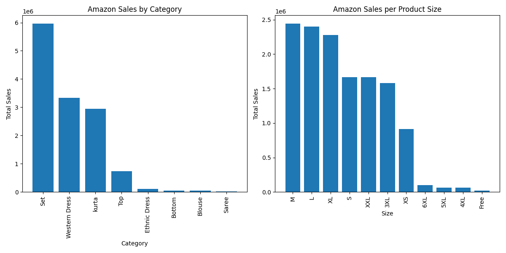

# E-Commerce Sales Data Analysis



## Project Overview

This project analyzes and visualizes e-commerce sales data using PostgreSQL, Pandas, and Matplotlib. The aim is to provide insights into sales trends, distribution by categories, and other key metrics through various visualizations.

## Table of Contents

- [Project Structure](#project-structure)
- [Setup Instructions](#setup-instructions)
- [Data Description](#data-description)
- [Usage](#usage)
- [License](#license)

## Project Structure

- `data/`: Contains the raw and cleaned datasets used in the analysis.
- `scripts/`: Contains SQL and Python scripts for data processing and visualization.
  - `db_scripts/`: SQL scripts for database initialization, data insertion, and exporting data.
  - `python_scripts/`: Python scripts for data cleaning and visualization.
- `visualizations/`: Contains generated visualizations in PNG format.

## Cloning the Repository

To clone this repository to your local machine, use the following command:

```bash
git clone https://github.com/tymoteuszmilek/E-Commerce-Sales-Data-Analysis.git
```

## Setup Instructions

1. **Unpack the Data**:
   - Unzip the files in the `data/` directory if they are in gzip format.
     Use the following command to unpack them:

    ```bash
    gzip -d data/uncleaned_data/*.gz
    ```
   - Ensure all files are unpacked before proceeding with the data processing.

2. **Create Database**:
   - Create a new PostgreSQL database.

3. **Data Cleaning**:
   - Navigate to the `python_scripts` folder.
   - Run `python3 clean_data.py` to clean the dataset.

4. **Database Initialization**:
   - Navigate to the `db_scripts` folder.
   - Log in to PostgreSQL using `psql -U [username] [database_name]`.
   - Execute `\i run_initializer.sql` to create tables, insert data, and create indexes and views.

5. **Extract Data**:
   - Run `\i csv_extractor.sql` to export queried data into CSV files.

6. **Generate Visualizations**:
   - Navigate to the `python_scripts` folder.
   - Run `python3 visualization.py` to generate visualizations.

7. **Check the `visualizations` folder** for the saved charts.

## Data Description

The datasets used are from [Unlock Profits with E-Commerce Sales Data](https://www.kaggle.com/datasets/thedevastator/unlock-profits-with-e-commerce-sales-data/data) on Kaggle. The data includes various aspects of e-commerce sales, including:

- Sales by Category
- Daily and Weekly Sales Distribution
- Customer Types
- Order Status
- Top SKUs
- Sales by Product Size
- Spending per Order

## License

This project is licensed under the MIT License. See the [LICENSE](https://github.com/tymoteuszmilek/E-Commerce-Sales-Data-Visualization/blob/main/LICENSE.md) file for details.
